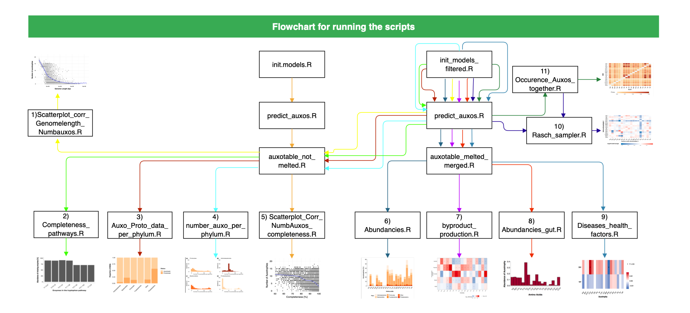

# Metabolic modeling of Auxotrophies in the human gut microbiota

## Project idea

Auxotrophic bacteria are not able for the synthesis of essential nutrients. So they are highly dependent on their nutritional environment. This project is about finding out which kind of auxotrophies can be found in human gut microbiota and what is the influence of auxotrophic gut microbiota on the host. The analyzed genomes are taken from the HRGM dataset including new genomes from Korea, India, Japan. With a  modeling approach, the metabolic function of the auxotrophic microbiota is studied. The production and uptake of nutrients and the association with different kind of auxotrophies is observed.  The following readme file gives an overview about the order of running the scripts. It always starts first with loading the models, predicting the auxotrophies and adding the information about the genomes but depending on the visualization aspects the created dataframes differ. 

## Instructions for running the scripts

For getting the figures as a result, the scripts need to be ran in a specific order. An overview about the running order is given by the flowchart below. Each colorful line represents the order of scripts for every figure. Detailed instructions are given under the flowchart. The scripts can be run in R (4.1.2). Further information about the R packages can be found in the first "load models" Scripts. 



### 1) Correlation between number of auxotrophies and genome length

##### Load models (Completeness >=85%, Contamination <=2)

```R
source("Scripts/init_models_filtered.R")
```

###### Predict auxotrophies

```R
source("Scripts/predict_auxos.R")
```

###### Add information about the genomes

```R
source("Scripts/auxotable_not_melted.R")
```

###### Correlation analysis for the genome length and the number of auxotrophies

```R
source("Scripts/Scatterplot_corr_Genomelength_Numbauxos.R")### 
```

### 2) Completeness of the amino acid biosynthesis pathways

##### Load models (Completeness >=85%, Contamination <=2)

```R
source("Scripts/init_models_filtered.R")
```

###### Predict auxotrophies

```R
source("Scripts/predict_auxos.R")
```

###### Add information about the genomes

```R
source("Scripts/auxotable_not_melted.R")
```

###### Analyze and then visualize the completeness of the amino acid biosynthesis pathways

```R
source("Scripts/Completeness_pathways.R")
```

### 

### 3)Proportions of auxotrophic to prototrophic MAGs  per phylum

##### Load models (Completeness >=85%, Contamination <=2)

```R
source("Scripts/init_models_filtered.R")
```

###### Predict auxotrophies

```R
source("Scripts/predict_auxos.R")
```

###### Add information about the genomes

```R
source("Scripts/auxotable_not_melted.R")
```

###### Analyze and then visualize the proportions of auxotrophic to prototrophic MAGs per phylum

```R
source("Scripts/Auxo_Proto_data_per_phylum.R")
```

### 4) Distribution of the number of auxotrophies per phylum

##### Load models (completeness >= 85% and contamination <=2)

```R
source("Scripts/init_models_filtered.R")
```

###### Predict auxotrophies

```R
source("Scripts/predict_auxos.R")
```

###### Add information about the genomes

```R
source("Scripts/auxotable_not_melted.R")
```

###### Analyze and visualize the distribution of the number of auxotrophies in every phylum

```R
source("Scripts/number_auxo_per_phylum.R")
```

### 5) Scatterplot about the correlation of the completeness and the found number of auxotrophies in all genomes

##### Load all models

```R
source("Scripts/init_models.R")
```

###### Predict auxotrophies

```R
source("Scripts/predict_auxos.R")
```

###### Add information about the genomes

```R
source("Scripts/auxotable_not_melted.R")
```

###### Visualize the correlation of Completeness of Genomes and Number of Auxotrophies

```R
source("Scripts/Scatterplot_Corr_NumbAuxos_Completeness.R")
```

### 6) Abundancies of amino acid auxotrophies

###### Load models (completeness >=85% and a contamination <=2)

```R
source("Scripts/init_models_filtered.R")
```

###### Predict auxotrophies

```R
source("Scripts/predict_auxos.R")
```

###### Add information about the genomes

```R
source("Scripts/auxotable_melted_merged.R")
```

###### Analyze amino acid auxotrophies

```R
source("Scripts/Abundancies.R")
```

### 7) Fermentation products(e.g.SCFA)

###### Load models (completeness >=85% and a contamination <=2)

```R
source("Scripts/init_models_filtered.R")
```

###### Predict auxotrophies

```R
source("Scripts/predict_auxos.R")
```

###### Add information about the genomes

```R
source("Scripts/auxotable_melted_merged.R")
```

###### Analyze the production of by products with statistical analysis

```R
source("Scripts/byproduct_production.R")
```

### 8) Effect of auxotrophic bacteria on the diversity of microbial communities

###### Load models from DZHK cohorte

```R
source("Scripts/DZHK_data_init.R")
```

###### Predict auxotrophies

```R
source("Scripts/predict_auxos.R")
```

###### Add information about the genomes

```R
source("Scripts/auxotable_melted_merged.R")
```

###### Effect of auxotrophic bateria on the diversity 

```R
source("Scripts/diversity_Auxos.R")
```

### 9) Association of auxotrophies with Health markers in DZHK cohorte

###### Load models from DZHK cohorte

```R
source("Scripts/DZHK_data_init.R")
```

###### Predict auxotrophies

```R
source("Scripts/predict_auxos.R")
```

###### Add information about the genomes

```R
source("Scripts/auxotable_melted_merged.R")
```

###### Analyze associations with and health markers

```R
source("Scripts/DZHK_Healthmarkers.R")
```

### 10) Abundancies of auxotrophic bacteria in DZHK cohorte

###### Load models

```R
source("Scripts/DZHK_data_init.R")
```

###### Predict auxotrophies

```R
source("Scripts/predict_auxos.R")
```

###### Add information about the genomes

```R
source("Scripts/auxotable_melted_merged.R")
```

###### Get abundancies 

```R
source("Scripts/Abundancies_Gut_DZHK.R")
```

### 11) Rasch Sampler

###### Load models() completeness >=85% and a contamination <=2)

```R
source("Scripts/init_models_filtered.R")
```

###### Predict auxotrophies

```R
source("Scripts/predict_auxos.R")
```

###### Rasch sampler

```R
source("Scripts/Rasch Sampler.R")
```

### 12) Occurence of Auxotrophies together

###### Load models() completeness >=85% and a contamination <=2)

```R
source("Scripts/init_models_filtered.R")
```

###### Predict auxotrophies

```R
source("Scripts/predict_auxos.R")
```

###### Add information about the genomes

```R
source("Scripts/Occurence_Auxos_together.R")### 
```

### 13) Frequency of auxotrophic bacteria in chronic inflammatory diseases (TrypCID)

###### Load models (completeness >=85% and a contamination <=2)

```R
source("Scripts/init_models_filtered.R")
```

###### Predict auxotrophies

```R
source("Scripts/predict_auxos.R")
```

###### Add information about the genomes

```R
source("Scripts/auxotable_melted_merged.R")
```

###### Analyze association with diseases

```R
source("Scripts/TrypCID.R")
```
### 14) Correlation between  the number of auxotrophies and the diversity

###### Load models 

```R
source("Scripts/DZHK_data_init.R.R")
```

###### Predict auxotrophies

```R
source("Scripts/predict_auxos.R")
```
###### Load all scripts from flow number 8 

###### Correlation analysis

```R
source("numb_auxos_div.R")
```

### 15) Crossfeeding observations by calculating hamming distance

###### Load models 

```R
source("Scripts/DZHK_data_init.R.R")
```

###### Predict auxotrophies

```R
source("Scripts/predict_auxos.R")
```
###### Load all scripts from flow number 8 

###### Calculating hamming distance for correlation of diversity and hamming distance

```R
source("hamming_distance.R")
```

### Further scripts that may be used in the future but are yet not displayed in the flowchart

### Completeness of bile acid metabolism pathways

###### Load models and filter them to get only the models with a completeness >=85% and a contamination <=2

```R
source("Scripts/init_models_filtered.R")
```

###### Predict auxotrophies

```R
source("Scripts/predict_auxos.R")
```

###### Add information about the genomes

```R
source("Scripts/auxotable_melted_merged.R")
```

###### Analyze bile acid metabolism pathways with statistical analysis

```R
source("Scripts/bile_acid_metabolism_trp_auxo.R")
```

### H2S Production by trp auxotrophic microbiota

###### Load models and filter them to get only the models with a completeness >=85% and a contamination <=2

```R
source("Scripts/init_models_filtered.R")
```

###### Predict auxotrophies

```R
source("Scripts/predict_auxos.R")
```

###### Add information about the genomes

```R
source("Scripts/auxotable_melted_merged.R")
```

###### Analyze H2S production with statistics

```R
source("Scripts/H2S_production_trp_auxo_statistics.R")
```

### Abundancies in the gut (FoCus cohorte)

###### Load models (completeness >=85% and a contamination <=2)

```R
source("Scripts/init_models_filtered.R")
```

###### Predict auxotrophies

```R
source("Scripts/predict_auxos.R")
```

###### Add information about the genomes

```R
source("Scripts/auxotable_melted_merged.R")
```

###### Analyze the abundance of auxotrophies in the gut by data from the FoCus cohorte

```R
source("Scripts/Abundancies_gut.R")
```

### Associations of auxotrophic bacteria and diseases (FoCus cohorte)

###### Load models (completeness >=85% and a contamination <=2)

```R
source("Scripts/init_models_filtered.R")
```

###### Predict auxotrophies

```R
source("Scripts/predict_auxos.R")
```

###### Add information about the genomes

```R
source("Scripts/auxotable_melted_merged.R")
```

###### Analyze associations with diseases or health factors(BMI, weight, age)

```R
source("Scripts/FoCus_new.R")
```

### Intake of amino acids and abundance of auxotrophic gut bacteria

###### Load models() completeness >=85% and a contamination <=2)

```R
source("Scripts/init_models_filtered.R")
```

###### Predict auxotrophies

```R
source("Scripts/predict_auxos.R")
```

###### Add information about the genomes

```R
source("Scripts/auxotable_melted_merged.R")
```

###### Spearman correlation

```R
source("Scripts/Nutrition_Auxos_FoCus.R")
```


